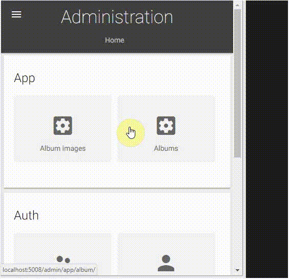

# Django Photo Gallery #

## Summary

This contains a Django 2.0.x Image Gallery Site. The album images are optimized for performance. The Django Photo Gallery Sample is responsive and mobile/device friendly.

### Create an album from the Django admin panel

Albums can be created from the Django admin panel where one zip file with all the images should be selected from the PC. The Django Photo Gallery will resize the images to improve the picute load times and will also create thumbnail for every image in the zip.

## Tested with Django / Python

## Additional Django apps dependencies
- Pillow
- django-material
- django-imagekit

## Additional JavaScript apps dependencies
- jquery
- photoswipe

## Prerequisites

- Django-Python [development environment](https://www.djangoproject.com/start/) already set up.
- virtualenv installed.

## Disclaimer
**THIS CODE IS PROVIDED *AS IS* WITHOUT WARRANTY OF ANY KIND, EITHER EXPRESS OR IMPLIED, INCLUDING ANY IMPLIED WARRANTIES OF FITNESS FOR A PARTICULAR PURPOSE, MERCHANTABILITY, OR NON-INFRINGEMENT.**

---

## Minimal Path to Awesome

- Clone this repository.
- Open the command line, navigate to the django app folder and execute:
    - `virtualenv env` (requires virtualenv)
    - Linux: `source env/bin/activate`, Windows: `call env/Scripts/activate.bat`
    - `pip install -r requirements.txt`
    - If the Pillow fail to install on Windows, then install it manually `pip install ../whl/Pillow-5.0.0-cp36-none-win32.whl` (if you are not using python 3.6 32 bit then  [download the Pillow wheel](http://www.lfd.uci.edu/~gohlke/pythonlibs/#pillow) for your python version).
    - `python manage.py runserver`
    - Open http://127.0.0.1:8000/ in web browser.
    - To access the admin forms go to http://127.0.0.1:8000/admin/ and enter user: admin, password: administrator
